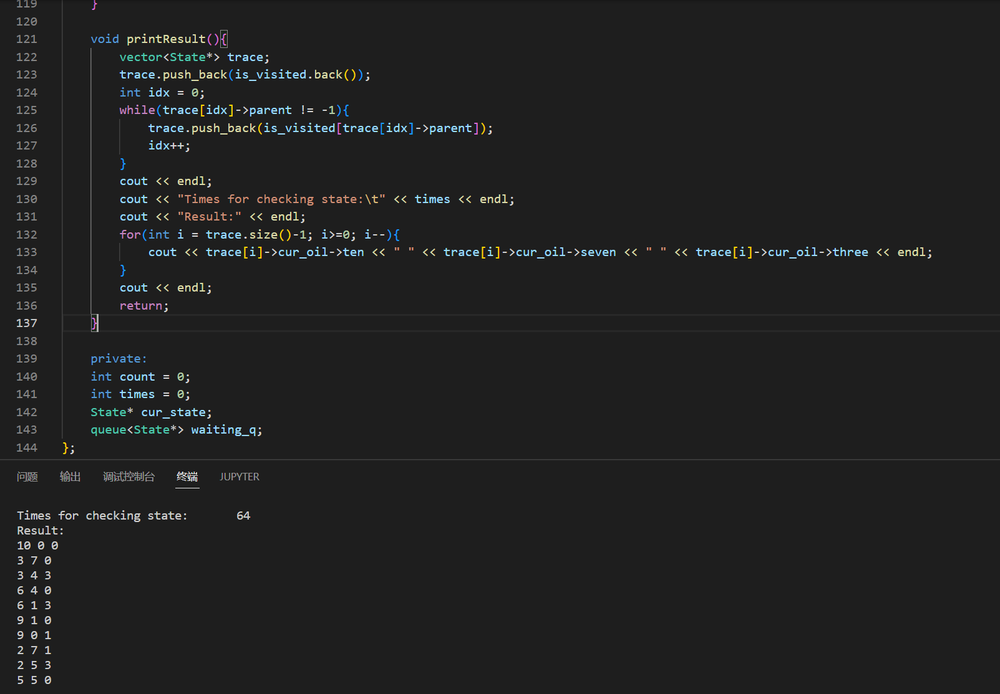

# Homework 1 小孩分油问题

姓名：杨成宇泽

学号：23020221154177

## 问题描述

小孩分油问题：两个小孩去打油，一人带了一个一斤的空瓶，另一个带了一个七两、一个三两的空瓶。原计划各打一斤油，可是由于所带的钱不够，只好两人合打了一斤油，在回家的路上，两人想平分这一斤油，可是又没有其它工具。试仅用三个瓶子(一斤、七两、三两)精确地分出两个半斤油来。

## 解题思路

1. 选择合适的数据结构，表示问题状态

   - 用向量$(K,S,T)$表示状态——$K$表示一斤瓶中的油量，$S$表示七两瓶中的油量，$T$表示三两瓶中的油量。
   - 注意到，此题与课上所述“油瓶分油问题”不同，此题中无其他工具，即一斤油只可以在三个油瓶中，即状态可表示为$(10-S-T,S,T)$。
   - 起始状态：不妨假设起始状态一斤油装在一斤瓶中，即初始状态为$(10,0,0)$。
   - 目标状态：$(5,5,0)$。

2. 确定智能算子，表示状态变化的规则

   - 注意到，一斤油恰好可以装满一斤瓶，且恰好可以同时装满七两瓶和三两瓶，故我们可以将一斤瓶视为“油瓶分油问题”中的油桶，以此简化规则。

| 规则号 | 规则                                                         | 解释                   |
   | ------ | ------------------------------------------------------------ | ---------------------- |
   | 1      | $(10-S-T,S,T)\ and\ S<7 \rightarrow (3-T,7,T)$               | 七两瓶不满时装满       |
   | 2      | $(10-S-T,S,T)\ and\ T<3 \rightarrow (7-S,S,3)$               | 三两瓶不满时装满       |
   | 3      | $(10-S-T,S,T)\ and\ S>0 \rightarrow (10-T,0,T)$              | 七两瓶不空时倒空       |
   | 4      | $(10-S-T,S,T)\ and\ T>0 \rightarrow (10-S,S,0)$              | 三两瓶不空时倒空       |
   | 5      | $(10-S-T,S,T)\ and\ S>0\ and\ S+T \le 3 \rightarrow (10-S-T,0,S+T)$ | 七两瓶中油全倒入三两瓶 |
   | 6      | $(10-S-T,S,T)\ and\ T>0\ and\ S+T \le 7 \rightarrow (10-S-T,S+T,0)$ | 三两瓶中油全倒入七两瓶 |
   | 7      | $(10-S-T,S,T)\ and\ T<3\ and\ S+T \ge 3 \rightarrow (10-S-T,S+T-3,3)$ | 用七两瓶中油装满三两瓶 |
   | 8      | $(10-S-T,S,T)\ and\ S<7\ and\ S+T \ge 7 \rightarrow (10-S-T,7,S+T-7)$ | 用三两瓶中油装满七两瓶 |

3. 搜索策略：选择使用广度优先搜索，层序遍历搜索树。

## 方法实现

1. 数据结构：

   - `Oil`类：油瓶类，具有属性`(ten,seven,three)`，用来表示（一斤瓶，七两瓶，三两瓶）中的油量。
   - `State`类：状态类，具有属性`(cur_oil,parent)`，其中`cur_oil`表示当前状态的油量，`parent`用于表示该状态的父状态，即该状态是由哪个状态变化而来的。
   - `Solution`类：题解类，具有属性`(is_visited,cur_state,waiting_q)`和方法`initialize(int ten, int seven, int three),in_visited_vector(State* s),BFS(),printResult()`。
     - `is_visited`：数据类型为`vector`，用于记录已经遍历过的状态。
     - `cur_state`：数据类型为`State*`，指示当前遍历的状态。
     - `waiting_q`：数据类型为`queue<State*>`，等待队列，用于广度优先搜索。

2. `Solution`类下的方法：`initialize(int ten, int seven, int three),in_visited_vector(State* s),BFS(),printResult()`。

   - `initialize(int ten, int seven, int three)`：初始化函数，设置起始状态。

   - `in_visited_vector(State* s)`：检查状态`s`是否已经遍历过，返回一个`bool`值。

   - `BFS()`：广度优先搜索主函数。算法如下：

     1）从等待队列头取出当前要检查的状态

     2）如果当前状态为目标状态，则结束；否则进行3）

     3）如果当前状态已经遍历过，则重新进行1）

     4）找到未遍历过的新状态，对新状态根据规则进行变化，并将新产生的状态加入等待队列

     5）将此状态放入`is_visited`中，重新进行1）

   - `printResult()`：打印函数，通过`is_visited`中的遍历结果打印题解。

## 求解结果

程序运行结果按向量$(K,S,T)$显示三个油瓶中的油量。

从程序运行结果可以得到解为：

| 状态号 | 一斤瓶 | 七两瓶 | 三两瓶 |
| ------ | ------ | ------ | ------ |
| 1      | 10     | 0      | 0      |
| 2      | 3      | 7      | 0      |
| 3      | 3      | 4      | 3      |
| 4      | 6      | 4      | 0      |
| 5      | 6      | 1      | 3      |
| 6      | 9      | 1      | 0      |
| 7      | 9      | 0      | 1      |
| 8      | 2      | 7      | 1      |
| 9      | 2      | 5      | 3      |
| 10     | 5      | 5      | 0      |

## 分析讨论

1. 根据解题思路中的观察，此题的状态可以压缩为$(S,T)$，$S$表示七两瓶中的油量，$T$表示三两瓶中的油量。从而，此题转化为课上“油瓶分油问题”，题目变为：如何在七两瓶中获得半斤油？转化后可以简化状态，减少程序的空间占用。
2. 从结果中可以看出，总共进行了64次状态检查，最终只有10个状态是解中的状态。这也体现出广度优先搜索的特点：随着深度增加，节点数目增长快。题解中使用`is_visited`来减少盲目搜索带来的节点重复增长。
3. 由于广度优先搜索的特点，获得的解必为路径最短的解，即操作数最少的解。
4. 反思我对规则表的简化，如果在规则中详细的描述一斤瓶对剩下两瓶的操作规则，增加了规则条数，相当于在搜索树中增加叉数。虽然可能由于状态不符合规则而被剪枝，但这样也可能会增加广义优先搜索树的遍历次数。

