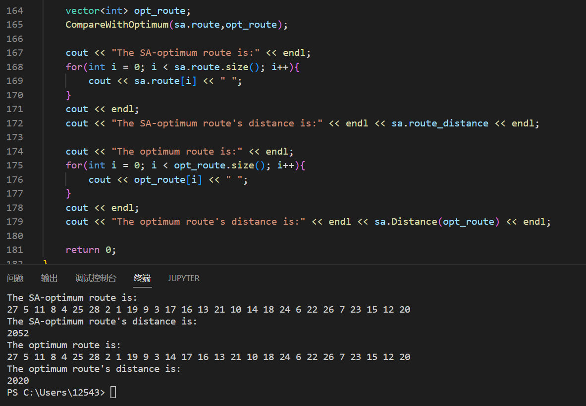
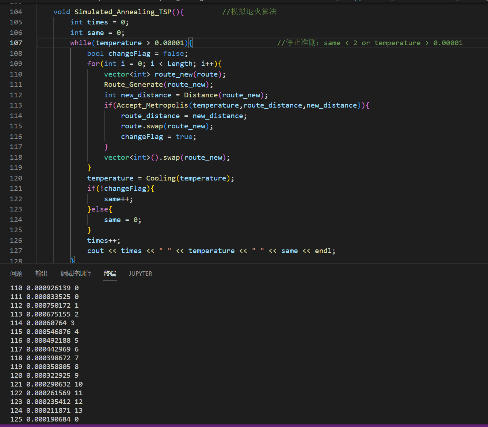

[toc]

# Homework 2 旅行商问题

姓名：杨成宇泽

学号：23020221154177

## 问题描述

旅行商问题（$Travelling \ Salesman \ Problem$，简记 $TSP$，亦称货郎担问题）：设有 $n$ 个城市和距离矩阵 $D = [d_{ij}]$，其中 $d_{ij}$ 表示城市 $i$ 到城市 $j$ 的距离，$i,j = 1,2,\cdots,n$，则问题是要找出遍访每个城市恰好一次的一条回路并使其路径长度为最短。

## 解题思路

1. $TSP$ 问题的一个解可以表述为一个循环排列 $\pi = (\pi_1,\pi_2,\cdots,\pi_n)$，即 $\pi_1 \rarr \pi_2 \rarr \cdots \rarr \pi_n \rarr \pi_1$。考虑到为循环排列，故可固定一个城市作为不动点，不妨固定 $\pi_1$ 为不动点，则不同的路径数为 $(n-1)!$ 条；又根据实际问题，因为两城市路径的距离与来访方向无关，所以我们知道，对于一条固定的路径，正向走和反向走的距离是相同的，即 $\pi_1 \rarr \pi_2 \rarr \pi_3 \rarr \cdots \rarr \pi_{n-1} \rarr \pi_n \rarr \pi_1$ 与 $\pi_1 \rarr \pi_n \rarr \pi_{n-1} \rarr \cdots \rarr \pi_3 \rarr \pi_2 \rarr \pi_1$ 的路径长度是相同的。故不同的路径数为 $\frac{(n-1)!}{2}$ 条。

2. 用模拟退火算法解 $TSP$ 问题：

   （1）固定 $\pi_1$ 为不动点，则实际对于解的表述为循环排列 $\pi' = (\pi_2,\pi_3,\cdots,\pi_n)$，仅有 $n-1$ 个城市。

   （2）采用2变换法产生新解。任选序号 $u$ 和 $v\ (u<v)$，将 $u$ 和 $v$ 及其之间的顺序逆转。

   - 例如：

     $(\pi_2,\cdots,\pi_{u-1},\pi_{u},\pi_{u+1},\cdots,\pi_{v-1},\pi_{v},\pi_{v+1},\cdots,\pi_n)$

     变为

     $(\pi_2,\cdots,\pi_{u-1},\pi_{v},\pi_{v-1},\cdots,\pi_{u+1},\pi_{u},\pi_{v+1},\cdots,\pi_n)$

   - 又考虑到上述的路径的无向性，我们在变换时排除将 $\pi_2$ 和 $\pi_n$ 互换的可能。

   - 在实现时，要注意需要排除 $u=v$ 的情况。

   （3）冷却进度表：

   - 控制参数 $t$ 的初值：$t_0 = 100$。
   - 控制参数 $t$ 的衰减函数：$\alpha(t) = 0.9*t$。
   - 控制参数 $t$ 的停止准则：连续两个 $Mapkob$ 链中对路径无任何变动时即停止算法运行。
   - $Mapkob$ 链长设置为定长 $L_k = 20000$ 。

## 方法实现

1. `void ReadFile(vector<vector<int>> &map)`：从文件中读取map。
2. `void CompareWithOptimum(vector<int> route,vector<int> &opt_route)`：从文件读取最优解，用于和模拟退火算法获得的解进行比较。
3. `SA_TSP`类：具有属性`(vector<vector<int>> map,vector<int> route,int route_distance,double temperature,int Length)`和方法`void Route_Generate(vector<int> &r),int Distance(vector<int> r),bool Accept_Metropolis(double t,int d_old, int d_new),double Cooling(double t),void Simulated_Annealing_TSP()`。
   - `vector<vector<int>> map`：$TSP$ map。
   - `vector<int> route`：当前最优的路径。
   - `int route_distance`：当前最优的路径的长度。
   - `double temperature`：当前的温度。
   - `int Length`：$Mapkob$ 链长。
4. `SA_TSP`类下的方法：
   - `void Route_Generate(vector<int> &r)`：采用2变换法产生新解，避免了重复路径和 $u=v$ 。
   - `int Distance(vector<int> r)`：计算路径距离。
   - `bool Accept_Metropolis(double t,int d_old, int d_new)`：Metropolis算法。
   - `double Cooling(double t)`：冷却函数。
   - `void Simulated_Annealing_TSP()`：模拟退火算法。

 ## 求解结果

模拟退火算法给出的近似最优解为：

$(0,27,5,11,8,4,25,28,2,1,19,9,3,17,16,13,21,10,14,18,24,6,22,26,7,23,15,12,20)$

此时的路径长度为2052。

## 分析讨论

1. 模拟退火算法通过从某一较高初温出发，伴随温度参数的不断下降，结合概率突跳特性在解空间中随机寻找目标函数的全局最优解，即在局部最优解能概率性地跳出并最终趋于全局最优。

2. 模拟退火算法是依赖于随机性的，故每次运行都可能获得不一样的近似最优解。

3. 对于冷却进度表中的控制参数：

   - 初始值应选取较大值，以尽可能扩大解空间。
   - 衰减函数应尽可能细粒度，衰减不应过大，以保证解空间逐步缩小。
   
   
   
   - 对于 $Mapkob$ 链长和停止准则：
   
     ​		本次实验示例中给出停止准则为：连续两个 $Mapkob$ 链中对路径无任何变动时即停止算法运行。但是在实际实验的过程中，我也使用控制参数达到某一阈值后停止算法运行的停止准则。
   
     ​		图示即为 $t \le 0.00001$ 的停止准则，可以看到，在第111次至第124次算法运行中 $Mapkob$ 链均无变化，但是在第125次出现了更优解。
   
     ​		实验发现，在第一次连续两个 $Mapkob$ 链中对路径无任何变动后，仍有更优解的出现。也就是说，有可能在很高温度下就实现了第一条停止准则，故第一条停止准则并不是非常理想的。
   
     ​		对于这个问题，我有以下两种解决方法：
   
     ​		1.扩大 $Mapkob$ 链的稳定性：可以选择变长的 $Mapkob$ 链，在温度低时适当加长 $Mapkob$ 链；可以收紧停止准则的条件，比如连续十个 $Mapkob$ 链中对路径无任何变动时即停止算法运行，以此来扩大跳出局部最优的可能性。
   
     ​		2.采用复合的停止准则：当控制参数达到某一阈值后，再采用连续两个 $Mapkob$ 链中对路径无任何变动时即停止算法运行的停止准则。这种方法保证了不会在很高的温度下就达到“假稳态”。

