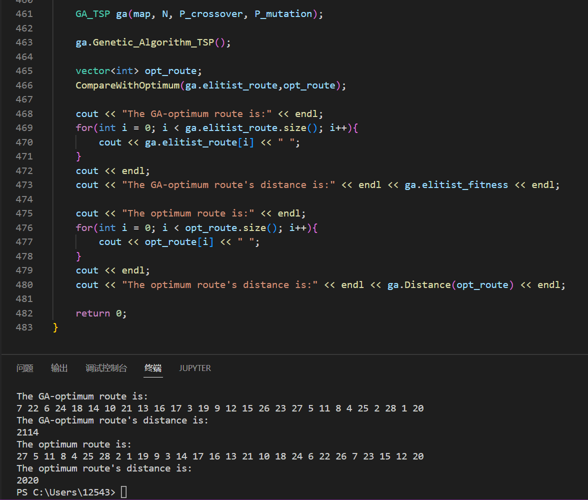

[toc]

# Homework 3 旅行商问题

姓名：杨成宇泽

学号：23020221154177

## 问题描述

旅行商问题（$Travelling \ Salesman \ Problem$，简记 $TSP$，亦称货郎担问题）：设有 $n$ 个城市和距离矩阵 $D = [d_{ij}]$，其中 $d_{ij}$ 表示城市 $i$ 到城市 $j$ 的距离，$i,j = 1,2,\cdots,n$，则问题是要找出遍访每个城市恰好一次的一条回路并使其路径长度为最短。

## 解题思路

使用遗传算法进行 $TSP$ 问题的求解。

1. 初始化：

   （1）种群规模：$N = 50$ ；

   ​		杂交概率：$P_c=0.6$ ；

   ​		变异概率：$P_m=0.01$ ；

   ​		终止进化准则：迭代代数高于1000代；

   （2）从 $\Omega$ 中随机选取 $N$ 个个体 $X_i(0)$ 组成初始种群 $X(0) = \{X_1(0),\dots,X_N(0)\}$，采用 Grefenstette 等所提出的编码方法，设 $X_i(0)$ 的染色体编码为 $Y_i(0)$，并记 $Y(0) = \{Y_1(0),\dots,Y_N(0)\}$；

   - $TSP$ 问题的一个解可以表述为一个循环排列 $\pi = (\pi_0,\pi_1,\cdots,\pi_{n-1})$，即 $\pi_0 \rarr \pi_1 \rarr \cdots \rarr \pi_{n-1} \rarr \pi_0$。考虑到为循环排列，故可固定一个城市作为不动点，不妨固定 $\pi_0$ 为不动点，则实际对于解的表述为排列 $\pi' = (\pi_1,\pi_2,\cdots,\pi_{n-1})$，仅有 $n-1$ 个城市。

   - Grefenstette 编码方法：

     ​		对于一个 $TSP$ 问题的已去除不动点 $\pi_0$ 的城市列表 $W$，假定对一个解为 $\pi' = (\pi_1,\pi_2,\cdots,\pi_{n-1})$。规定每访问完一个城市，就从城市列表 $W$ 中将该城市去掉，则用第 $i(i = 1,2,\cdots,n-1)$ 个所访问的城市 $\pi_i$ 在所有未访问城市列表 $W - \{\pi_1,\pi_2,\cdots,\pi_{i-1}\}$ 中的对应位置序号 $g_i(0 \le g_i \le n-i)$ 就可表示具体访问哪个城市，如此这样直到处理完 $W$ 中所有的城市。将全部 $g_i$ 顺序排列在一起所得到的一个列表：$G = (g_1,g_2,\cdots,g_{n-1})$ 就可表示一条巡回路线，它即为遗传算法中一个个体的基因型。

   （3）计算 $Y_i(0)$ 的适应性值 $J(Y_i(0))$，也就是 $TSP$ 问题中的路径距离；

   （4）置 $k=0$ 。 

2. 种群进化：

   （1）执行 $M(M\ge \frac{N}{2})$ 步如下操作，$M$ 要选取足够大的值以产生新种群：

   ​		a）对每一基因型 $Y_i(k)$ 依据其适应性，采用比例选择规则赋一繁殖概率 $P_i(k)$；

   ​		b）以概率 $P_i(k)(1\le i\le N)$ 从 $Y(k)$ 中随机选取两个个体，分别记作 $Y_{i1}(k)$ 和 $Y_{i2}(k)$；

   ​		c）以概率 $P_c$ 对 $Y_{i1}(k)$ 和 $Y_{i2}(k)$ 进行杂交，产生两个中间个体 $s_1^{'}$ 和 $s_2^{'}$；

   ​				交叉算子：单点交叉、双点交叉等概率进行。

   ​		d）以概率 $P_m$ 对中间个体 $s_1^{'}$ 和 $s_2^{'}$ 进行变异，产生两个新个体 $s_1$ 和 $s_2$。

   ​				变异算子：常规变异、倒位变异、交换变异、插入变异等概率进行。

   （2）计算所产生的 $2M$ 个新个体的适应性，对这 $2M$ 个新个体连同 $Y(k)$ 由精英选择确定 $N$ 个个体组成新一代种群 $Y(k+1) = \{Y_1(k+1),\dots,Y_N(k+1)\}$。

3. 检验终止判据：如果迭代代数高于1000代，则终止演化，并输出最优解；否则，置 $k:=k+1$，返回上一步。

## 方法实现

1. `void ReadFile(vector<vector<int>> &map)`：从文件中读取map。

2. `void CompareWithOptimum(vector<int> route,vector<int> &opt_route)`：从文件读取最优解，用于和遗传算法获得的解进行比较。

3. `GA_TSP`类下的属性：

   - `vector<vector<int>> map`：$TSP$ map。
   - `int N`：种群规模。
   - `double P_crossover`：杂交概率。
   - `double P_mutation`：变异概率。
   - `vector<int> elitist_route`：当前代最优解。
   - `int elitist_fitness`：当前代最优解的适应性。
   - `int M`：每一代繁殖次数。
   - `int cities`：城市数。
   - `int generation`：种群进化代数。
   - `vector<vector<int>> population`：当前种群。
   - `vector<vector<int>> chromosome`：当前种群染色体编码。
   - `vector<int> fitness`：当前种群适应性。

4. `GA_TSP`类下的方法：

   - `void shuffle(vector<int> &r)`：产生随机序列，用于种群初始化。

   - `void Encode(vector<int> route, vector<int> &gene)`：染色体编码。

   - `void Decode(vector<int> gene, vector<int> &route)`：染色体解码。

   - `int Distance(vector<int> r)`：通过路径（个体）计算路径长度（个体适应性）。

   - `int Distance_from_gene(vector<int> gene)`：通过个体的染色体编码计算个体适应性。

   - `void Initial_population()`：种群初始化。

   - `void Calculate_reproduction_probability(vector<int> fitness, vector<double> &p_r)`：对每一基因型 $Y_i(k)$ 依据其适应性，采用比例选择规则赋一繁殖概率 $P_i(k)$。记 $max =\mathop{max}\limits_{i}(J(Y_i(k))) $，这里在计算繁殖概率时使用如下`trick`：

     $P_i(k)=\frac{max - J_i(k)+1}{\sum\limits_{i=1}^{N}(max-J_i(k)+1)}$，这样可以保证 $P_i(k)$ 恒不为零且适应性更好的个体拥有更高的繁殖概率。

   - `pair<int,int> Select_pair(vector<double> p_r)`：以概率 $P_i(k)(1\le i\le N)$ 从 $Y(k)$ 中随机选取两个个体作为杂交父代。

   - `void Crossover(pair<int,int> parents, vector<int> &mid1, vector<int> &mid2)`：交叉算子，单点交叉、双点交叉等概率进行。

     - `void one_point_crossover(pair<int,int> parents, vector<int> &mid1, vector<int> &mid2)`：单点交叉。
     - `void two_point_crossover(pair<int,int> parents, vector<int> &mid1, vector<int> &mid2)`：双点交叉。

   - `void Mutation(vector<int> &mid)`：变异算子，常规变异、倒位变异、交换变异、插入变异等概率进行。

     - `void general_mutation(vector<int> &mid)`：常规变异。
     - `void reverse_mutation(vector<int> &mid)`：倒位变异。
     - `void exchange_mutation(vector<int> &mid)`：交换变异。
     - `void insert_mutation(vector<int> &mid)`：插入变异。

   - `int Elitist()`：获得当前种群适应性最好个体的下标。

   - `void Genetic_Algorithm_TSP()`：遗传算法主函数。

5. 精英选择的实现方法：优先队列` priority_queue<pair<int,vector<int>>, vector<pair<int,vector<int>>>, cmp> pq`。

   - 队列中元素为<个体适应性，个体基因型>。
   - 将所有进化产生的子代入队列，用个体适应性（路径长度）升序排列。
   - 新一代种群由父代最优解和优先队列前 $N-1$ 个子代构成。

 ## 求解结果

遗传算法给出的近似最优解为：

$(0,7,22,6,24,18,14,10,21,13,16,17,3,19,9,12,15,26,23,27,5,11,8,4,25,2,28,1,20)$

此时的路径长度为2114。

## 分析讨论

1. 遗传算法仅使用了种群的适应性信息，并不使用梯度等启发性信息。种群会趋于向适应性更好的方向集体进化，变异是进化的根本保证。
2. 变异给个体带来了跳出种群稳态适应性的方法，故适当调高变异概率可以使得种群更快地进化；但是过高的变异概率会使得种群进化速度减缓。
3. 根据适应性赋繁殖概率的机制有文章可做，如何给更优的个体赋更高的值，又保证其他个体仍然有机会参与杂交，需要更精明的策略。