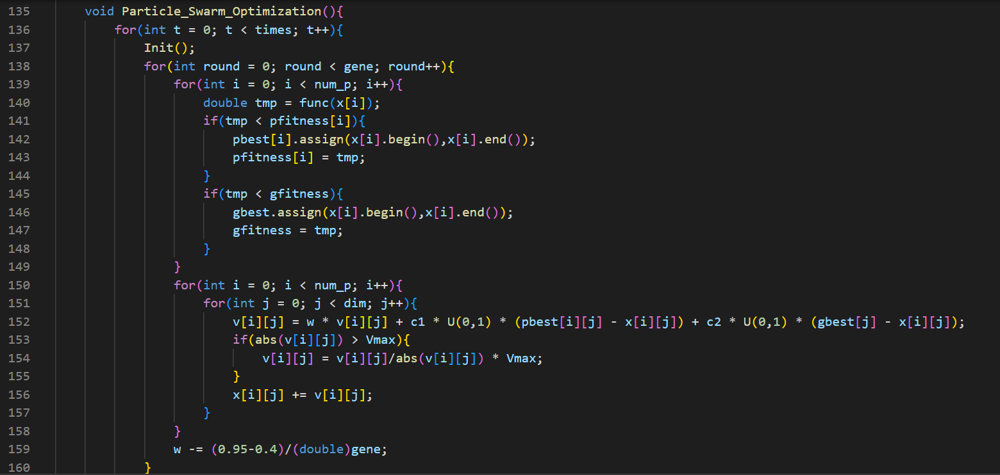
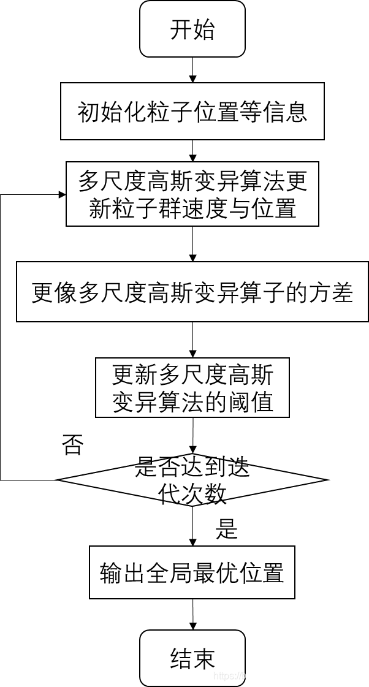
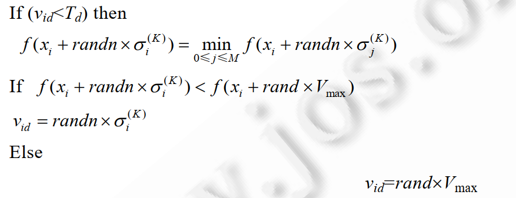
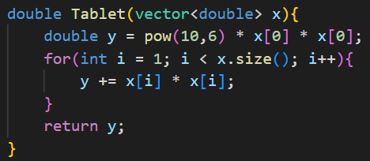
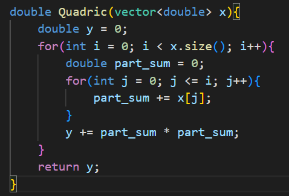
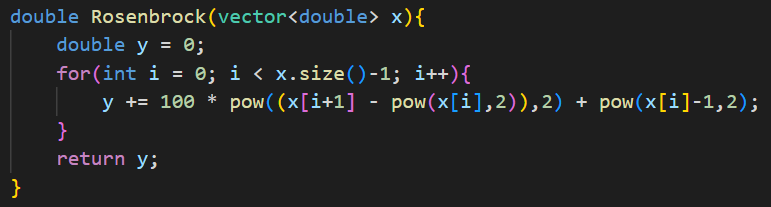
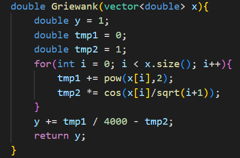
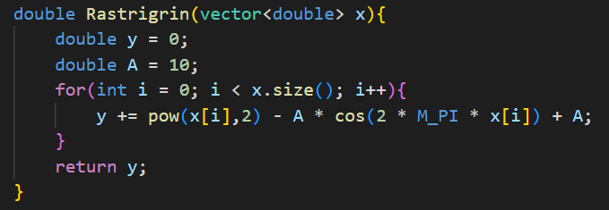
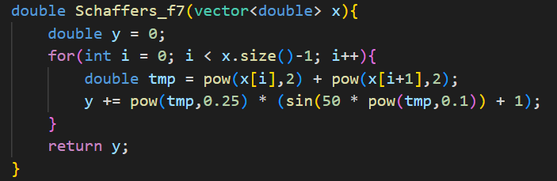

[toc]

# Homework 4 粒子群优化算法

姓名：杨成宇泽

学号：23020221154177

## 问题描述

编写程序实现论文“一种多尺度协同变异的粒子群优化算法”（哈尔滨工程大学陶新民等,《软件学报》，2012年07期）的部分测试实验。

- 至少编程实现传统 $PSO$ 算法和论文所提出的 $MAEPSO$ 算法。
- 至少测试论文中的三个 $Benchmark$ 函数。

## 解题思路

粒子群算法（$Particle\ Swarm\ Optimization$，简称$PSO$）是一种基于群体智能的优化算法，但存在早熟和收敛慢的问题。针对此问题，论文提出一种多尺度协同变异的自适应粒子群算法（$multiscale\ cooperative\ mutatingly\ selfadaptive\ escape\ PSO$,简称 $MAEPSO$）。该算法利用不同大小方差的自适应高斯变异机制实现解空间的探索，这种多个或大或小的变异机制能够促使整个种群以尽量分散的变异尺度来对解空间进行更加详尽的探索。

## 方法实现

实现了两个类：PSO、MAEPSO。

PSO类：

- 成员函数仅有：构造函数、析构函数、初始化函数、PSO主函数。

  

MAEPSO类：

- 算法流程：

  

- 算法具体实现：

  - 初始化：`void Init()`。

  - 更新适应度：`void Update_fitness()`。

  - 更新速度和坐标：` void Update_v_x()`。

    - 在此部分，如果粒子的速度超过了阈值，则给该粒子一个逃逸的操作，这是算法的关键，这是使得算法不易陷入到局部最优位置，更加容易的去找到全局最优解。

      

  - 更新方差： `void Update_sigma()`。实现整个解空间的覆盖性搜索。

  - 更新阈值：`void Update_T()`。一种自适应的阈值设定方法：设微粒各维速度间相互独立，并对每维速度均给予一个不同的阈值，当该维度中有多个微粒速度达到这个值时，阈值就自动下降，通过这种方式达到动态调整微粒速度的目的。

 ## 求解结果

本次实验均采用论文中的初始化数据：采用线性下降惯性权重，w 在[0.95,0.4]之间随迭代数线性递减；c1 = 1.4，c2 = 1.4，K1 = 5，K2 = 10，M = 5，初始方差 σ0 为优化变量的范围，Td = 0.5，种群规模均为 20，函数维度为 30，每次运行 6000 代。  

使用六个 Benchmark 测试函数对算法进行测试。

单模态函数：

- Tablet：

  

- Quadric：

  

- Rosenbrock：

  

|        | Tablet      | Quadric | Rosenbrock |
| ------ | ----------- | ------- | ---------- |
| PSO    | 1.71891e-13 | 3.88775 | 1.8355     |
| MAEPSO | 0.905183    | 8010.73 | 3129.71    |

多模态函数：

- Griewank：

  

- Rastrigrin：

  

- Schaffers_f7：

  

|        | Griewank  | Rastrigrin | Schaffers_f7 |
| ------ | --------- | ---------- | ------------ |
| PSO    | 0.0221267 | 84.5712    | 5.27423      |
| MAEPSO | 0.133841  | 81.4548    | 2.1986       |

## 分析讨论

从上表中可以看出，实现的具体细节还是有些问题的，导致算法未能达到预期目标，目前我也在一直寻找问题的原因。

而我在实验中观察到，MAEPSO的执行时间远远大于标准的PSO算法，这或许是因为MAEPSO中需要更复杂的变量。

从实验数据中也可以看出，PSO算法在解决问题的过程中确实容易出现早熟的现象，尤其是多模态函数的情况下。