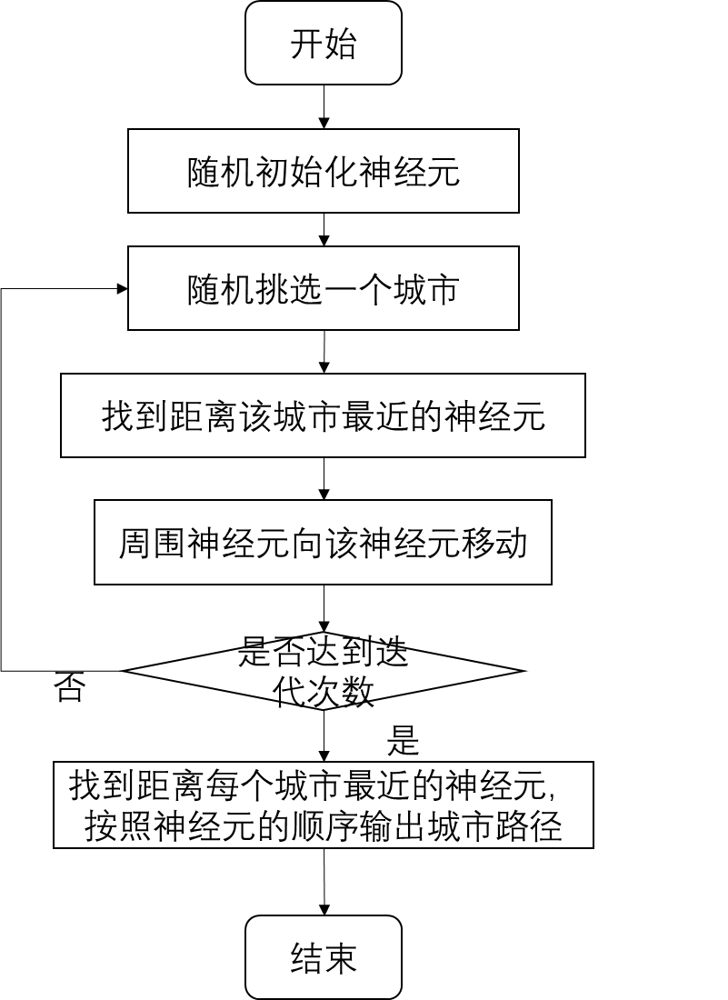
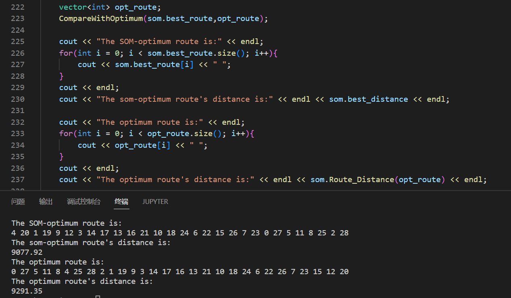
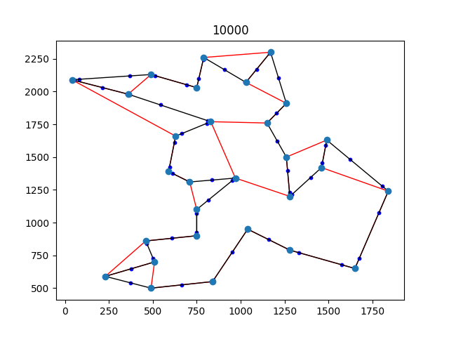

[toc]

# Homework 5 旅行商问题

姓名：杨成宇泽

学号：23020221154177

## 问题描述

旅行商问题（$Travelling \ Salesman \ Problem$，简记 $TSP$，亦称货郎担问题）：设有 $n$ 个城市和距离矩阵 $D = [d_{ij}]$，其中 $d_{ij}$ 表示城市 $i$ 到城市 $j$ 的距离，$i,j = 1,2,\cdots,n$，则问题是要找出遍访每个城市恰好一次的一条回路并使其路径长度为最短。

## 解题思路

本次实验使用自组织映射算法解决旅行商问题。

自组织映射（$Self-Organizing \ Maps$，$SOM$）是一种无监督学习的神经网络。$SOM$ 有输入和输出两层神经网络，从输入层输入的数据代表着真实世界的模式。在训练中，输出层神经元的权值向量会被更新，输出层神经元在训练中逐渐学到输入数据背后的模式。

对旅行商问题而言，二维城市坐标是网络的输入向量，城市空间位置关系是 $SOM$ 要学习的模式，而网络的输出是一个环形的神经元结构。

$SOM$ 算法的主要原理就是每次找到离城市最近的神经元，称为获胜神经元；然后以该神经元建立分布更新其他神经元的位置（向该获胜神经元靠近），也就是更新输出神经元权值向量，通过不断的迭代，输出神经元会逐渐学习到输入数据背后的模式。

## 方法实现

$SOM$ 算法流程图如下图所示：

其中：

（1）随机初始化神经元的位置。这里神经元的个数采用的是城市个数的八倍。

（2）找到离城市最近的神经元的位置的时候，这里的距离度量采用的是欧式距离。

（3）周围神经元向该被选中的获胜神经元移动的规则：以当前选中城市的获胜神经元为圆心，根据一个神经元与获胜神经元的“相似性”（由论文中的G函数测度），让所有神经元向着当前选中城市移动。

（4）在每一次迭代的过程中，G函数中的K在不断的减少，学习率也在不断的减少。

（5）最后最短路径的输出是按照神经元的顺序排序，然后根据神经元的顺序输出城市路径即为最短路径。

 ## 求解结果

$SOM$ 最优解：

最优路径长度为9077.92。

第10000次迭代结果图形化展示：

（红色为文件中最优路径，黑色为 $SOM$ 最优路径，浅蓝色点为城市，深蓝色点为神经元）

## 分析讨论

旅行商问题属于 $NP-hard$ 问题，无法在线性的复杂度中求解。自组织映射（$SOM$）是一种无监督学习的神经网络，将各个城市的坐标作为输入之后，该网路的神经元通过高斯分布不断的靠近城市坐标的位置，从而不断学到了输入数据的模式，最后得到了一条优化的最短城市路径。通过实验结果可以看出该方法在求解 $TSP$ 问题上往往可以得到比较优化的解，与真实解相差不大。